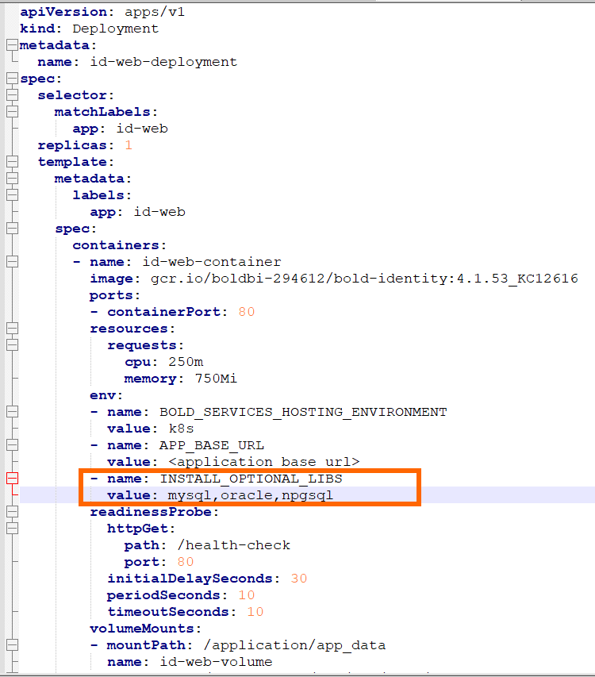

# Consent to deploy client libraries

By giving consent to install client libraries to connect with Oracle, PostgreSQL, MySQL, you can use the following libraries in your kubernetes pods. Bold Reports uses these client libraries to connect with their respective SQL database variants. Read about the licenses of each library to give consent for usage. 

## Oracle.ManagedDataAccess
* Oracle

[Oracle License](https://www.oracle.com/downloads/licenses/distribution-license.html)

## Npgsql 4.0.0
* PostgreSQL

[PostgreSQL License](https://github.com/npgsql/npgsql/blob/main/LICENSE)

## MySQLConnector 0.45.1
* MySQL
* MemSQL
* MariaDB

[MIT License](https://github.com/mysql-net/MySqlConnector/blob/master/LICENSE)

## PhantomJS WebKit

Please refer the phantomjs installation steps from the following link.
    
[Consent-to-deploy-phantomjs-webkit](../docs/install-opt-library.md)

# Client library names as arguments for Bold Reports deployment in Kubernetes

Find the names of client libraries, which needs to be passed as a comma separated string for an environment variable in **deployment.yaml** file.

| Library                   | Name          |
| -------------             | ------------- |
| Oracle.ManagedDataAccess  | oracle        |
| Npgsql 4.0.0              | npgsql        |
| MySQLConnector 0.45.1     | mysql         |

If you want to use all client libraries in the Bold Reports application, then pass the following string as value for `INSTALL_OPTIONAL_LIBS` environment variable. You need to add the names only for the libraries, which you are consenting to use with Bold Reports application.

`mysql,oracle,npgsql`

 
